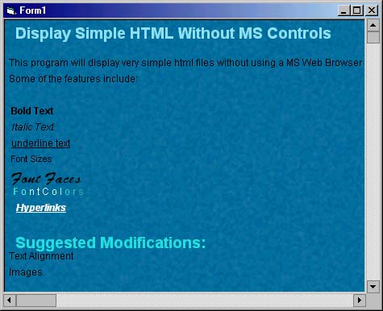



## View HTML without MS Controls 1\.2 \- Speed Bug Fixed

### Description

The speed bug has been fixed, thanks for your input guys. Anyone have ideas on images? I am thinking of BitBlting them onto the picture but the X - Y positions get messed up, same thing with alignment.

 

This is a little test I wrote to see if VB do this sort of thing. As of right now it is pretty boring, and only accepts a few HTML command like BOLD, Italics, and Font Styles and I added Hyperlinks this morning. I need help with this thing so if you can, vote or send me an email. There are a few bad bugs in it (like the screen flickering) but let me know what you think so far. Thanks Bryan Cairns.
 
### More Info
 
Nasty flicker as screen repaints, and I am having trouble with the BitBLT code to put images on the page.

             |
---                |---
**Submitted On**   |2002-01-07 16:37:22
**By**             |[Bryan A\. Cairns](https://github.com/Planet-Source-Code/PSCIndex/blob/master/ByAuthor/bryan-a-cairns.md)
**Level**          |Beginner
**User Rating**    |4.9 (34 globes from 7 users)
**Compatibility**  |VB 6\.0
**Category**       |[Internet/ HTML](https://github.com/Planet-Source-Code/PSCIndex/blob/master/ByCategory/internet-html__1-34.md)
**World**          |[Visual Basic](https://github.com/Planet-Source-Code/PSCIndex/blob/master/ByWorld/visual-basic.md)
**Archive File**   |[View\_HTML\_47064172002\.zip](https://github.com/Planet-Source-Code/bryan-a-cairns-view-html-without-ms-controls-1-2-speed-bug-fixed__1-30461/archive/master.zip)

### API Declarations

A TON - see the zip file

